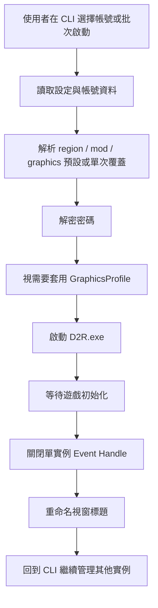
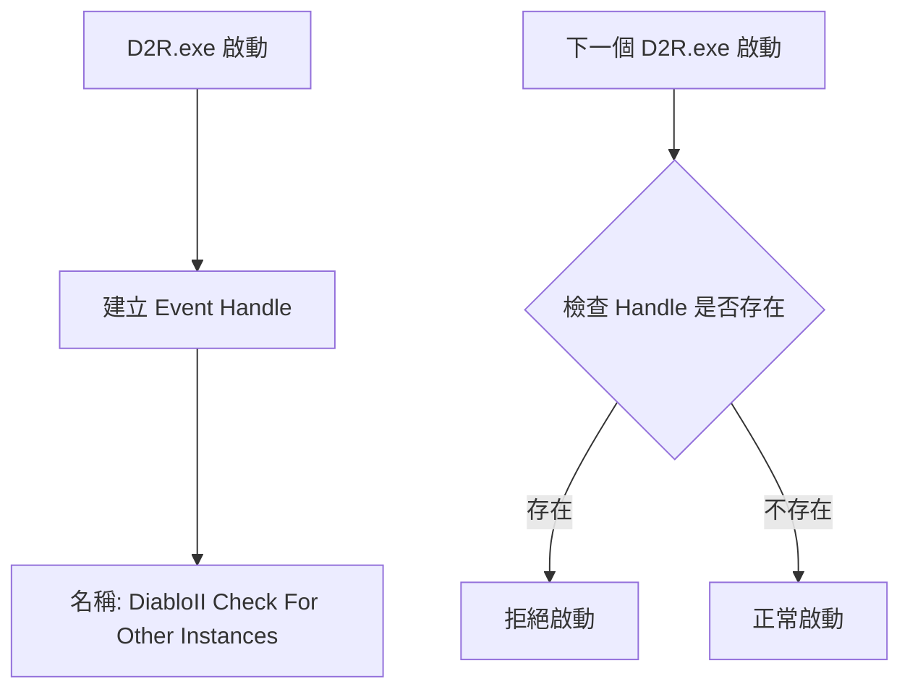
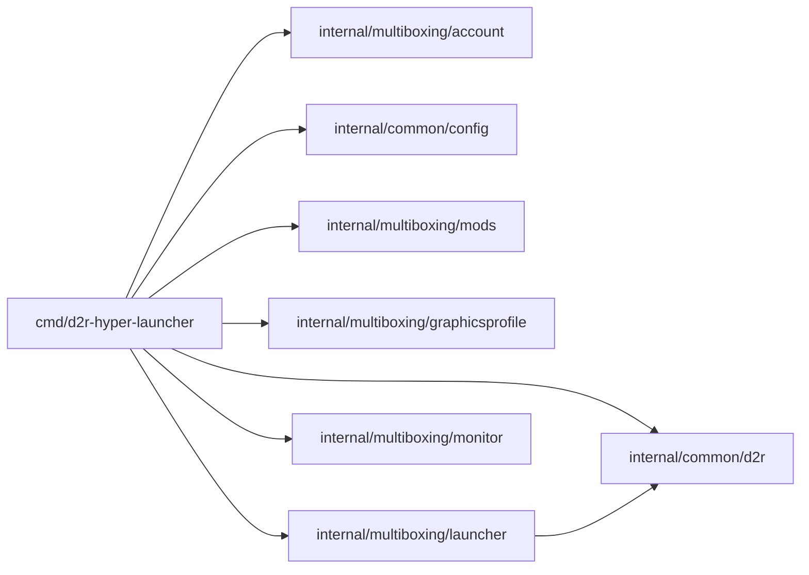
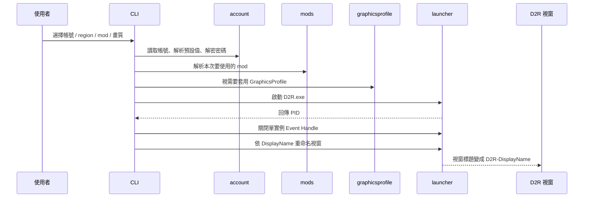
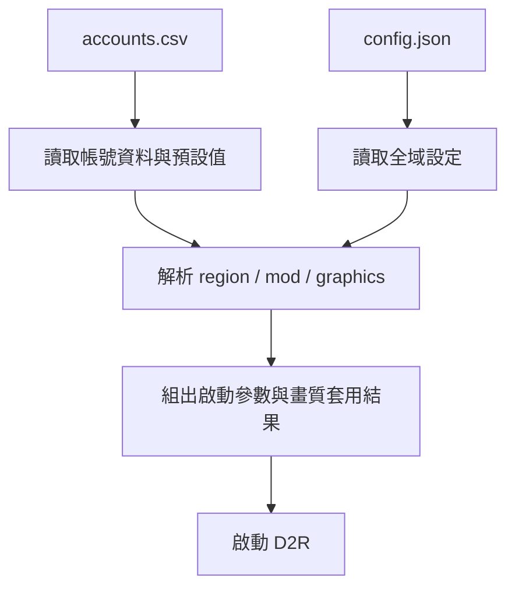
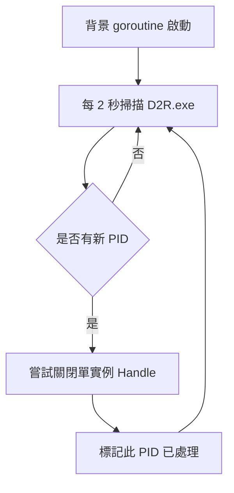

# Multiboxing 技術導覽

> 這份文件整理自專案早期 multiboxing 規劃與現行實作，目標是提供「給人類閱讀」的 multiboxing 技術導覽。
> 如果你想先看整套多開文件怎麼分工，請先讀 [multiboxing-index.md](multiboxing-index.md)；如果你要查某個 D2R flag 或 mod 參數的用途，再配合 [D2R_PARAMS.md](D2R_PARAMS.md) 一起看。

## 這個 scope 在解什麼問題

Diablo II: Resurrected 預設只允許同時開啟一個遊戲實例。
對多帳號玩家而言，真正的問題不是「如何再啟動一個程式」，而是 **如何讓第二個 D2R 不會被單實例鎖擋掉**。

這個專案的 multiboxing scope 目前主要負責這幾件事：

1. 管理多個 Battle.net 帳號
2. 在啟動前解析每帳號的 `DefaultRegion`、`DefaultMod`、`GraphicsProfile` 或這次手動覆蓋
3. 啟動 D2R 並帶入必要參數
4. 串接 per-account `LaunchFlags` 與 mod 參數
5. 視需要在啟動前套用對應的 `GraphicsProfile`
6. 自動處理單實例鎖、視窗命名與後續辨識流程
7. 透過背景 monitor 持續處理新出現的 D2R PID

---

## 整體概念

從高層來看，multiboxing 的流程是：

這裡最關鍵的步驟是 **關閉 D2R 建立的單實例 Event Handle**。

---

## D2R 的單實例鎖是怎麼工作的

D2R 啟動時，會建立一個名為 `DiabloII Check For Other Instances` 的 Windows Event Handle。
後續新啟動的 D2R 會檢查這個 handle 是否存在；如果存在，就拒絕繼續啟動。

因此，multiboxing 的核心不是修改遊戲檔案，而是 **在正確時機處理這個 Windows handle**。

---

## 專案中的 multiboxing 架構

目前相關模組可以從職責上拆成下列幾層：

### 模組分工

| 模組 | 角色 |
|---|---|
| [`cmd/d2r-hyper-launcher/`](../cmd/d2r-hyper-launcher/) | CLI 流程協調、單帳號啟動、批次啟動、背景監控 |
| [`internal/multiboxing/account/`](../internal/multiboxing/account/) | 帳號 CSV 讀寫、密碼加解密、預設值正規化 |
| [`internal/common/config/`](../internal/common/config/) | `config.json` 與資料目錄管理 |
| [`internal/multiboxing/mods/`](../internal/multiboxing/mods/) | 掃描已安裝 mod、`DefaultMod` 正規化與啟動參數組裝 |
| [`internal/multiboxing/graphicsprofile/`](../internal/multiboxing/graphicsprofile/) | `Settings.json` 畫質設定檔儲存與讀取 |
| [`internal/multiboxing/launcher/`](../internal/multiboxing/launcher/) | 啟動 D2R、關閉單實例 handle、視窗重命名 |
| [`internal/multiboxing/monitor/`](../internal/multiboxing/monitor/) | 背景追蹤新出現的 D2R PID 並補做 handle 清理 |
| [`internal/common/d2r/`](../internal/common/d2r/) | D2R 常數、區域與視窗命名規則 |

---

## 啟動單一帳號時，系統實際做了什麼

單一帳號啟動可以理解成一條從「帳號資料」走到「可辨識遊戲視窗」的流水線：

這個設計有兩個實務上的好處：

- 使用者可以直接從 CLI 看到哪個帳號已啟動
- 後續 switcher scope 可以透過統一視窗標題前綴來切換視窗

---

## 帳號資料與設定資料

multiboxing 主要依賴兩種本地資料：

### 1. `accounts.csv`

用來保存 Battle.net 帳號資料，目前固定會寫回 8 欄：

`Email,Password,DisplayName,LaunchFlags,ToolFlags,GraphicsProfile,DefaultRegion,DefaultMod`

舊 4 / 5 / 6 / 7 欄 CSV 仍可載入，工具會在下次存檔時自動升級回目前的 8 欄格式。

- `LaunchFlags`：代表這個帳號額外要帶的 D2R 啟動參數；若使用者手動填入無效值，載入時會自動 fallback 為 `0` 並回寫。
- `ToolFlags`：工具內部的帳號功能設定，與 D2R 啟動參數無關。目前 bit 0 (`1`) 代表把此帳號排除在 switcher 切換循環外；若填入未定義的 bit，載入時也會自動清除並回寫。
- `GraphicsProfile`：每個帳號的預設畫質來源。畫質選單按 Enter 時會使用它；若欄位留空，launcher 這次就完全不動 `Settings.json`。若指向的畫質設定檔已不存在，launcher 會先自動清空再把它視為未設定。
- `DefaultRegion`：每個帳號預設登入的 Battle.net 區域。region 選單按 Enter 時會使用它；若缺少設定，工具會明確擋下，不會 silent fallback。
- `DefaultMod`：每個帳號預設載入的 mod。mod 選單按 Enter 時會使用它；若保存值是 `<vanilla>`，代表預設走原版。若保存的 mod 已不存在，launcher 會先自動清空再把它視為未設定。

### 2. `config.json`

用來保存整體設定，例如：

- D2R 安裝路徑
- 啟動間隔
- 其他跨功能設定

---

## 為什麼要做密碼加密

帳號密碼需要被程式讀取來啟動 D2R，但直接把明文密碼長期放在 CSV 風險太高。
因此這個 scope 使用 **Windows DPAPI** 把密碼綁定在目前 Windows 使用者上，讓它適合當作「本機使用、低管理成本」的保護方式。

這不是雲端等級的密鑰管理方案，但很適合這種本機 CLI 工具。

---

## 背景監控為什麼存在

即使使用者不是每次都透過 CLI 啟動 D2R，工具仍會在背景週期性掃描新的 D2R 行程。
只要發現尚未處理的新 PID，就會再做一次單實例 handle 關閉。

這個背景監控讓 multiboxing 不只是一個「啟動器」，更像一個持續協助多開環境穩定的守護流程。

---

## 這個 scope 的設計重點

### 1. 以 Windows 為核心平台

這個 scope 不是跨平台抽象層，而是明確建立在 Windows process / handle / window API 之上。

### 2. CLI 優先

不引入 GUI，所有操作都以終端互動與檔案設定為主。

### 3. 與其他 scope 協作

multiboxing 雖然本身能完成啟動與辨識，但它也會提供後續功能可依賴的結果，例如：

- 統一的視窗標題
- 可重複的啟動流程
- 可追蹤的帳號狀態

### 4. 安全邊界清楚

只有核心 handle 模組會碰 NT API；其他部分盡量維持在較高階、較穩定的 Windows / Go API。

---

## 閱讀這個 scope 時，建議先看哪裡

如果你是第一次理解 multiboxing，建議順序如下：

1. 先讀 [`README.md`](../README.md) 了解整體使用情境
2. 再讀 [`multiboxing-usage-guide.md`](multiboxing-usage-guide.md) 看玩家實際操作流程
3. 接著讀 [`cmd/d2r-hyper-launcher/main.go`](../cmd/d2r-hyper-launcher/main.go) 看主流程
4. 再看 [`internal/multiboxing/launcher/`](../internal/multiboxing/launcher/) 了解啟動、視窗處理與 handle 清理
5. 最後讀 [`internal/multiboxing/account/`](../internal/multiboxing/account/) 與 [`internal/multiboxing/mods/`](../internal/multiboxing/mods/) 理解 CSV、預設值與 mod 解析

---

## 與其他多開文件怎麼搭配

- 玩家操作步驟，以 [`multiboxing-usage-guide.md`](multiboxing-usage-guide.md) 為主
- D2R 啟動參數、`LaunchFlags` 對照與 `-mod` / `-txt` 細節，以 [`D2R_PARAMS.md`](D2R_PARAMS.md) 為主
- 如果要先確認這幾份文件各自負責什麼，先看 [`multiboxing-index.md`](multiboxing-index.md)

---

## 總結

multiboxing scope 的本質，是把一個原本只能單開的遊戲，轉化成一個可被 CLI 管理、可批次啟動、可辨識各視窗、可持續監控的新操作流程。

它不是單純的「多按一次啟動」，而是一條整合了：

- 帳號管理
- 本機密碼保護
- Windows 進程控制
- handle 關閉
- 視窗辨識

的完整工作鏈。

