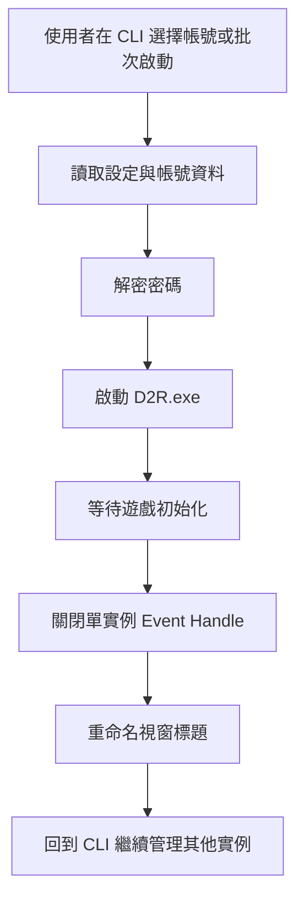
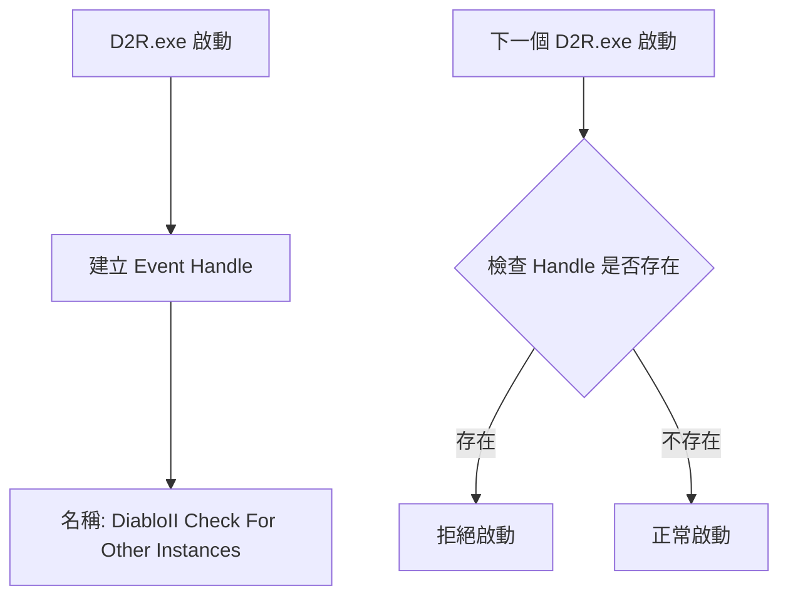
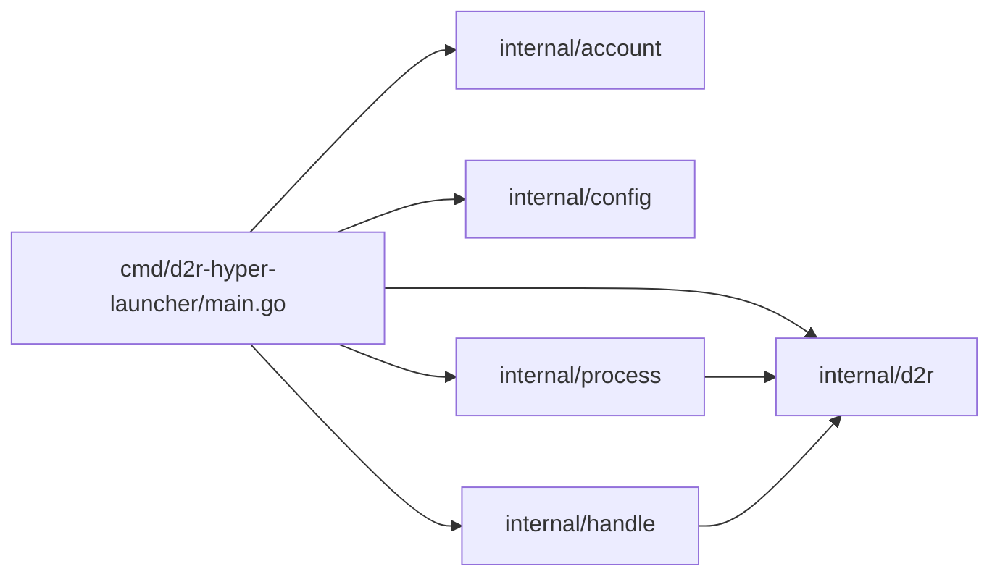
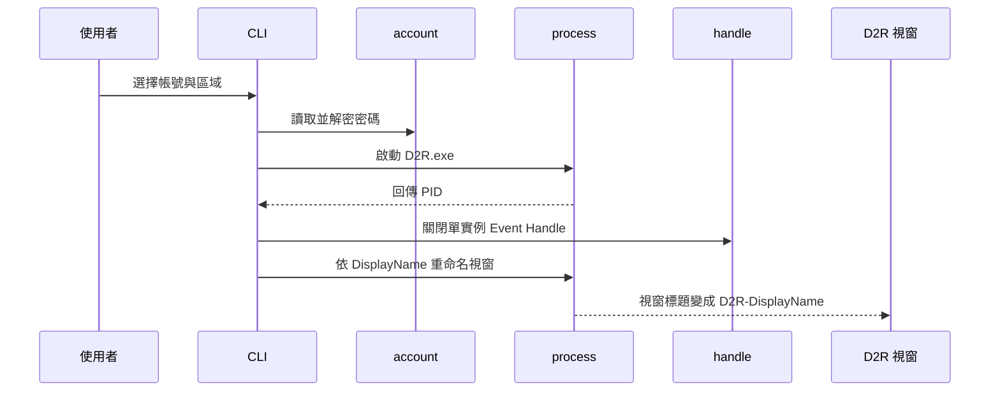
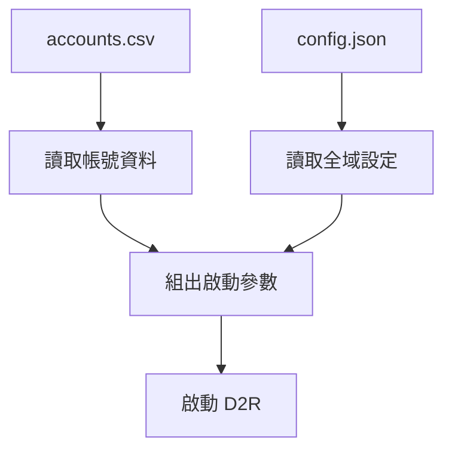
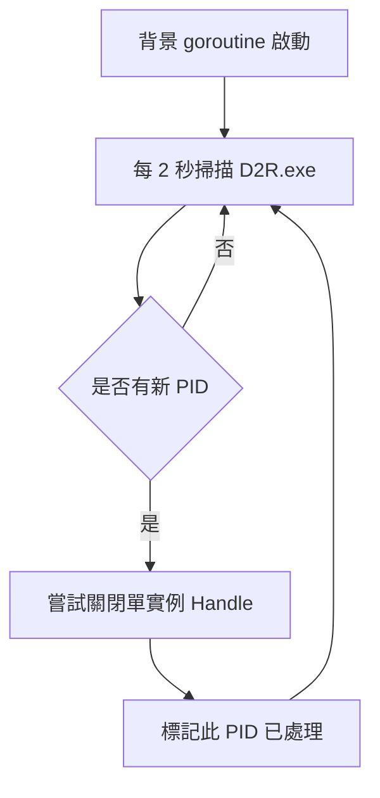

# Multiboxing 技術導覽

> 這份文件整理自專案早期 multiboxing 規劃與現行實作，目標是提供「給人類閱讀」的 multiboxing 技術導覽。

## 這個 scope 在解什麼問題

Diablo II: Resurrected 預設只允許同時開啟一個遊戲實例。
對多帳號玩家而言，真正的問題不是「如何再啟動一個程式」，而是 **如何讓第二個 D2R 不會被單實例鎖擋掉**。

這個專案的 multiboxing scope 主要負責三件事：

1. 管理多個 Battle.net 帳號
2. 啟動 D2R 並帶入必要參數
3. 自動處理單實例鎖與後續辨識流程

---

## 整體概念

從高層來看，multiboxing 的流程是：

這裡最關鍵的步驟是 **關閉 D2R 建立的單實例 Event Handle**。

---

## D2R 的單實例鎖是怎麼工作的

D2R 啟動時，會建立一個名為 `DiabloII Check For Other Instances` 的 Windows Event Handle。
後續新啟動的 D2R 會檢查這個 handle 是否存在；如果存在，就拒絕繼續啟動。

因此，multiboxing 的核心不是修改遊戲檔案，而是 **在正確時機處理這個 Windows handle**。

---

## 專案中的 multiboxing 架構

目前相關模組可以從職責上拆成下列幾層：

### 模組分工

| 模組 | 角色 |
|---|---|
| [`cmd/d2r-hyper-launcher/main.go`](../cmd/d2r-hyper-launcher/main.go) | CLI 流程協調、單帳號啟動、批次啟動、背景監控 |
| [`internal/account/`](../internal/account/) | 帳號 CSV 讀寫、密碼加解密 |
| [`internal/config/`](../internal/config/) | `config.json` 與資料目錄管理 |
| [`internal/process/`](../internal/process/) | 啟動 D2R、尋找進程、視窗重命名 |
| [`internal/handle/`](../internal/handle/) | 列舉並關閉目標 handle |
| [`internal/d2r/`](../internal/d2r/) | D2R 常數、區域與視窗命名規則 |

---

## 啟動單一帳號時，系統實際做了什麼

單一帳號啟動可以理解成一條從「帳號資料」走到「可辨識遊戲視窗」的流水線：

這個設計有兩個實務上的好處：

- 使用者可以直接從 CLI 看到哪個帳號已啟動
- 後續 switcher scope 可以透過統一視窗標題前綴來切換視窗

---

## 帳號資料與設定資料

multiboxing 主要依賴兩種本地資料：

### 1. `accounts.csv`

用來保存 Battle.net 帳號資料，包含登入信箱、密碼與顯示名稱。

### 2. `config.json`

用來保存整體設定，例如：

- D2R 安裝路徑
- 啟動間隔
- 其他跨功能設定

---

## 為什麼要做密碼加密

帳號密碼需要被程式讀取來啟動 D2R，但直接把明文密碼長期放在 CSV 風險太高。
因此這個 scope 使用 **Windows DPAPI** 把密碼綁定在目前 Windows 使用者上，讓它適合當作「本機使用、低管理成本」的保護方式。

這不是雲端等級的密鑰管理方案，但很適合這種本機 CLI 工具。

---

## 背景監控為什麼存在

即使使用者不是每次都透過 CLI 啟動 D2R，工具仍會在背景週期性掃描新的 D2R 行程。
只要發現尚未處理的新 PID，就會再做一次單實例 handle 關閉。

這個背景監控讓 multiboxing 不只是一個「啟動器」，更像一個持續協助多開環境穩定的守護流程。

---

## 這個 scope 的設計重點

### 1. 以 Windows 為核心平台

這個 scope 不是跨平台抽象層，而是明確建立在 Windows process / handle / window API 之上。

### 2. CLI 優先

不引入 GUI，所有操作都以終端互動與檔案設定為主。

### 3. 與其他 scope 協作

multiboxing 雖然本身能完成啟動與辨識，但它也會提供後續功能可依賴的結果，例如：

- 統一的視窗標題
- 可重複的啟動流程
- 可追蹤的帳號狀態

### 4. 安全邊界清楚

只有核心 handle 模組會碰 NT API；其他部分盡量維持在較高階、較穩定的 Windows / Go API。

---

## 閱讀這個 scope 時，建議先看哪裡

如果你是第一次理解 multiboxing，建議順序如下：

1. 先讀 [`README.md`](../README.md) 了解整體使用情境
2. 再讀 [`multiboxing-usage-guide.md`](multiboxing-usage-guide.md) 看玩家實際操作流程
3. 接著讀 [`cmd/d2r-hyper-launcher/main.go`](../cmd/d2r-hyper-launcher/main.go) 看主流程
4. 再看 [`internal/process/`](../internal/process/) 了解啟動與視窗處理
5. 最後讀 [`internal/handle/`](../internal/handle/) 理解核心 handle 關閉機制

---

## 總結

multiboxing scope 的本質，是把一個原本只能單開的遊戲，轉化成一個可被 CLI 管理、可批次啟動、可辨識各視窗、可持續監控的新操作流程。

它不是單純的「多按一次啟動」，而是一條整合了：

- 帳號管理
- 本機密碼保護
- Windows 進程控制
- handle 關閉
- 視窗辨識

的完整工作鏈。

