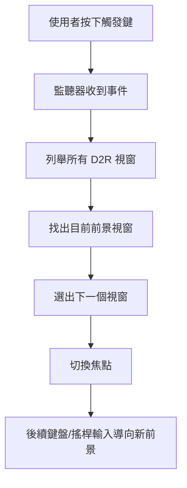
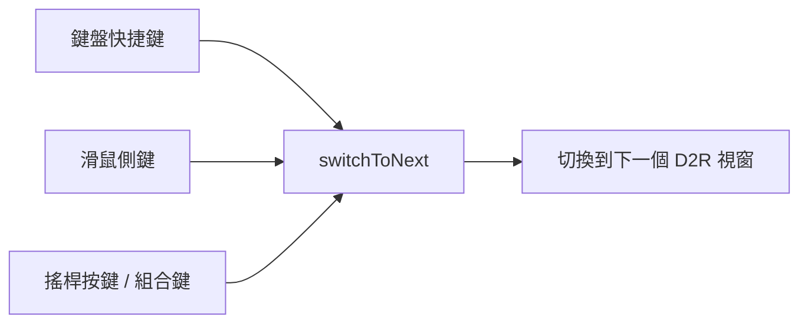
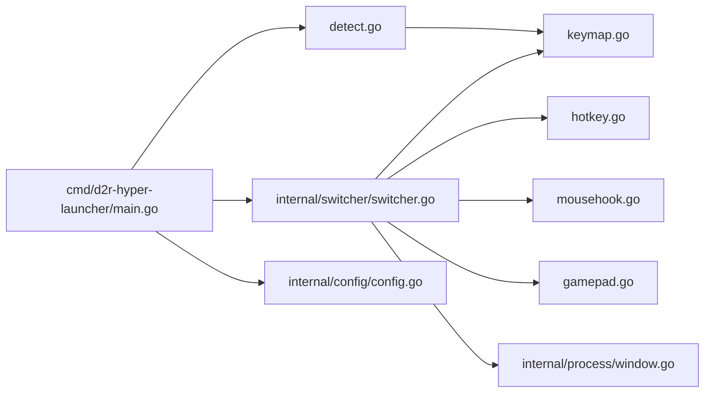
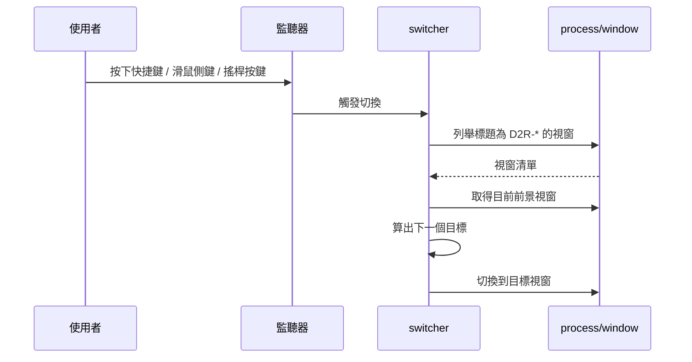
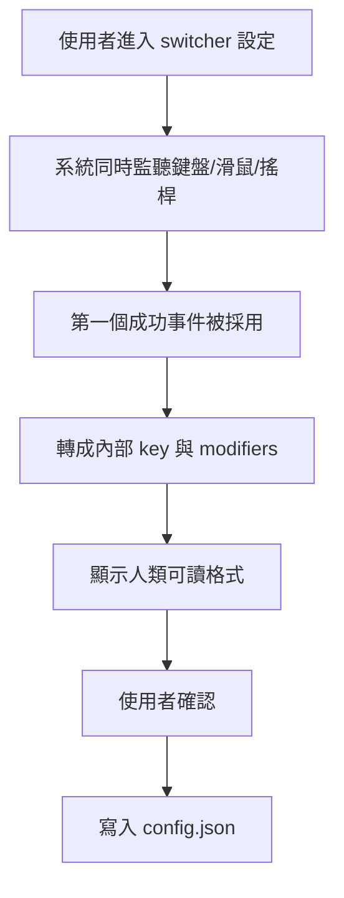
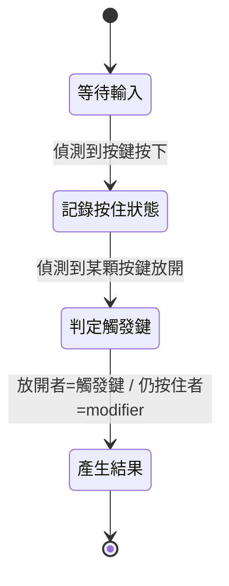
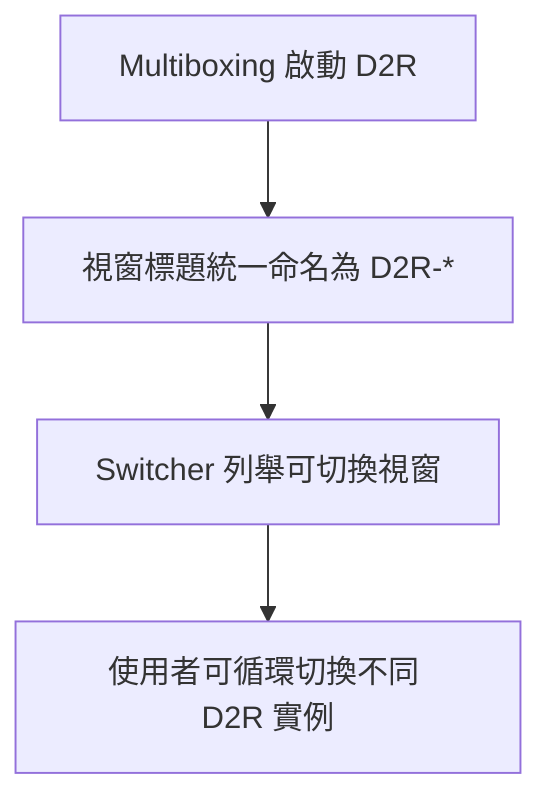

# Switcher 技術導覽

> 這份文件整理自專案早期 switcher 規劃與現行實作，目標是提供「給人類閱讀」的 switcher 技術導覽。

## 這個 scope 在解什麼問題

當 D2R 已經能多開之後，新的問題就出現了：
**使用者怎麼快速把鍵盤或搖桿輸入送到正確的 D2R 視窗？**

Windows 的輸入模型決定了多數裝置只會把輸入送到目前前景視窗，因此 switcher scope 不去做高風險的輸入隔離，而是採取更實際的策略：

- 偵測一個使用者自訂的觸發方式
- 快速切換到下一個 D2R 視窗

---

## 核心概念

switcher 的核心不是「把搖桿綁到某個視窗」，而是「把前景視窗切換到想控制的那個 D2R」。

---

## 為什麼不用更激進的方式

從技術上看，還有其他方法可以嘗試，例如 DLL 注入、攔截輸入 API、改變遊戲對前景視窗的判斷等等。
但這些做法風險高、維護成本高，也更容易踩到安全或防護問題。

因此這個 scope 選擇了較穩健的路線：

- 不碰遊戲程式內部
- 不做輸入裝置隔離
- 只處理 **Windows 視窗焦點切換**

---

## 支援哪些觸發方式

switcher 目前支援三大類輸入來源：

| 類型 | 例子 | 說明 |
|---|---|---|
| 鍵盤快捷鍵 | `Ctrl+Tab`、`Alt+F1` | 適合鍵盤玩家 |
| 滑鼠側鍵 | `XButton1`、`XButton2` | 適合用滑鼠快速切窗 |
| 搖桿按鍵 | `Gamepad_A`、`LT+A` | 適合主手把操作 |

這些輸入最終都會匯流到同一條「切換視窗」路徑。

---

## Runtime 架構

從模組角度來看，switcher 可以拆成「觸發偵測」與「視窗切換」兩部分：

### 模組分工

| 模組 | 角色 |
|---|---|
| [`cmd/d2r-hyper-launcher/main.go`](../cmd/d2r-hyper-launcher/main.go) | 設定引導、啟用 / 停用 switcher |
| [`internal/switcher/switcher.go`](../internal/switcher/switcher.go) | 啟動對應監聽方式、統一切換邏輯 |
| [`internal/switcher/hotkey.go`](../internal/switcher/hotkey.go) | 鍵盤快捷鍵監聽 |
| [`internal/switcher/mousehook.go`](../internal/switcher/mousehook.go) | 滑鼠側鍵監聽 |
| [`internal/switcher/gamepad.go`](../internal/switcher/gamepad.go) | XInput 搖桿輪詢與觸發 |
| [`internal/switcher/detect.go`](../internal/switcher/detect.go) | CLI 設定時的按鍵偵測 |
| [`internal/switcher/keymap.go`](../internal/switcher/keymap.go) | 鍵名、修飾鍵與顯示格式轉換 |
| [`internal/process/window.go`](../internal/process/window.go) | 列舉與切換 D2R 視窗 |

---

## 視窗切換實際上怎麼發生

switcher 的核心邏輯很單純，但要建立在 multiboxing 已正確命名視窗的前提上。

這表示 switcher 並不需要知道每個帳號的登入資訊，它只依賴：

- D2R 視窗存在
- 視窗標題符合約定

---

## 設定流程為什麼是互動式

這個 scope 選擇用 CLI 引導使用者直接「按下想要的按鍵」，而不是要求手動編輯 JSON。
原因很實際：

- 一般人不一定知道滑鼠側鍵在系統裡的名稱
- 搖桿按鍵與組合鍵更不適合手填
- 互動式偵測可以降低設定門檻，也能避免拼字錯誤

---

## 為什麼搖桿組合鍵比較特別

搖桿不像鍵盤有天然明確的 modifier 概念，因此這個 scope 在設定時採用一個很直覺的規則：

- 先按住修飾鍵
- 再按觸發鍵
- 最後放開觸發鍵完成偵測

這個設計的好處是系統能判斷：

- 哪個按鍵是「真正用來觸發切換」
- 哪些按鍵只是「仍被按住的修飾條件」

---

## Config 在這個 scope 的角色

switcher 最終會把設定寫到 `config.json`，讓工具下次啟動時能自動恢復切窗能力。

概念上會保存：

- 是否啟用
- 主要觸發鍵
- 修飾鍵
- 若是搖桿則保存控制器編號

這個設計讓 switcher 具備兩種模式：

1. **設定模式**：透過偵測取得輸入
2. **執行模式**：直接依 config 啟動對應監聽器

---

## 與 multiboxing 的關係

switcher 雖然是獨立 scope，但它強烈依賴 multiboxing 提供的基礎：

換句話說，multiboxing 解決「怎麼把多個 D2R 開起來」，switcher 解決「開起來之後怎麼快速控制它們」。

---

## 這個 scope 的設計重點

### 1. 高速但低侵入

它追求的是毫秒級切換體驗，但不使用高風險的遊戲內部操作。

### 2. 事件來源多樣，但出口單一

雖然支援鍵盤、滑鼠、搖桿三種來源，但最後都收斂到同一個切換函式，讓邏輯更穩定。

### 3. 配置對人類友善

設定流程以「按一下要用的按鍵」為中心，而不是要求使用者理解系統代碼或虛擬鍵值。

### 4. 依賴現有視窗命名慣例

這個 scope 刻意不自己建立額外辨識體系，而是直接沿用 `D2R-` 視窗前綴。

---

## 閱讀這個 scope 時，建議先看哪裡

如果你是第一次理解 switcher，建議順序如下：

1. 先讀 [`switcher-usage-guide.md`](switcher-usage-guide.md) 中的視窗切換設定流程
2. 再讀 [`internal/switcher/switcher.go`](../internal/switcher/switcher.go) 理解主邏輯
3. 接著依需求看 [`hotkey.go`](../internal/switcher/hotkey.go)、[`mousehook.go`](../internal/switcher/mousehook.go)、[`gamepad.go`](../internal/switcher/gamepad.go)
4. 最後讀 [`detect.go`](../internal/switcher/detect.go) 與 [`keymap.go`](../internal/switcher/keymap.go) 理解設定體驗

---

## 總結

switcher scope 的價值不在於把輸入做複雜隔離，而在於提供一條 **安全、直覺、夠快** 的 D2R 視窗切換路徑。

它把原本多開後容易混亂的操作體驗，整理成：

- 可設定的觸發方式
- 一致的視窗辨識規則
- 可重複使用的切換邏輯

讓多開不只「能開」，也真的「能操作」。

